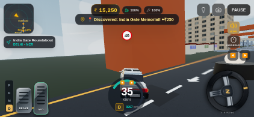
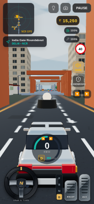

# Steering and control verification

The steering hit area stays fixed while the wheel art rotates. Grabbing the rim does not change steering; horizontal dragging anywhere on the wheel turns in the drag direction, including the lower rim. Vertical movement does not change steering. A pointer owns its gesture until release, cancellation or lost capture. Pause, focus loss and hidden tabs reset both held inputs and the visible controls. Pedals support a separate finger, brakes override gas, and transmission buttons select P/R/N/D directly.

Steering and yaw smoothing use frame-rate independent exponential interpolation. High-speed turns are limited by cornering grip, braking cannot push a stopped car into reverse, and the fixed-step budget handles the engine’s maximum clamped frame duration.

## Checks

- `npm test`: 14 tests passed, including both turn directions in forward/reverse, left/right drag direction at every grab position, lower-rim drag through vehicle turning, pointer ownership, centre drag, input reset/clamping, brake priority, reverse-to-forward shifting, high-speed grip and the fixed-step budget.
- `npm run lint`: TypeScript passed.
- `npm run build`: production build passed. The existing Three.js vendor-size warning remains.
- Chromium touch checks: no steering on touch-down; clockwise/counterclockwise drag; simultaneous gas and steering with measured vehicle acceleration; release and touch cancellation; pause/resume; left/right wheel layouts; portrait control separation. No page errors observed.

Browser checks use software WebGL, low graphics and a reduced backing-buffer resolution. These checks do not establish physical-device performance or native-platform behavior.

Direction correction: the former angular gesture reversed horizontal drags below the hub. Regression checks now cover the top, bottom, both sides and centre, plus lower-rim gestures through vehicle physics.
