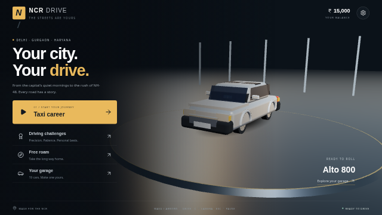
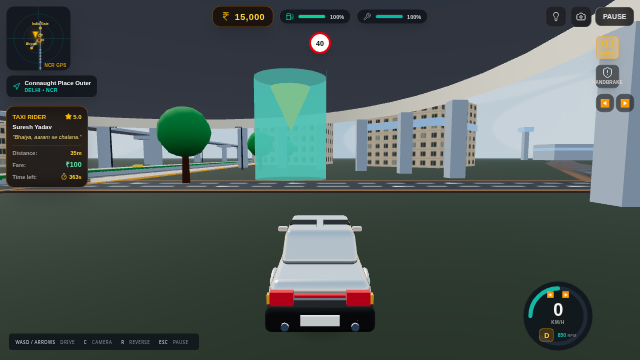
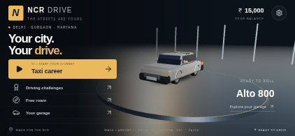

# Upgrade verification

Verified in Chromium with software WebGL, low graphics and a reduced backing-buffer resolution. These checks establish browser behavior, not performance on a phone GPU.

| Check | Result |
| --- | --- |
| TypeScript (`npm run lint`) | Passed |
| Input, steering, physics and camera regression tests (`npm test`) | 14 passed |
| Production build (`npm run build`) | Passed; Three.js vendor chunk remains above 500 kB uncompressed |
| Desktop menu, driving and pause | Passed |
| Taxi offer acceptance and taxi HUD | Passed |
| Mission selection and progression locks | Passed |
| Landscape phone touch controls | Steering and pedals visible |
| Landscape menu fit, 844 × 390 CSS pixels | Garage button ends at y=341; all modes fit |
| Browser errors in desktop taxi/mission flow | None observed |
| Production offline reload and free-roam start | Passed, no browser errors |

The production service worker activates and caches the game assets. Offline reload and entering free roam were verified with Chromium network access disabled. Full pickup-to-drop-off completion, native Android/iOS builds, physical-device frame rates and multiplayer were not verified in this upgrade.

